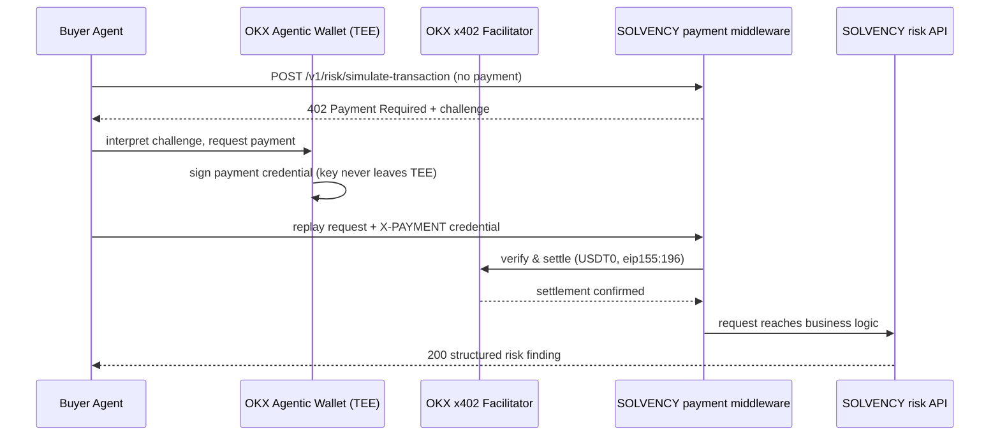
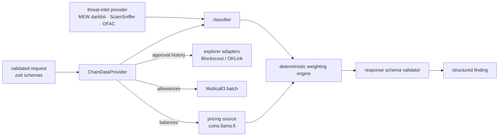
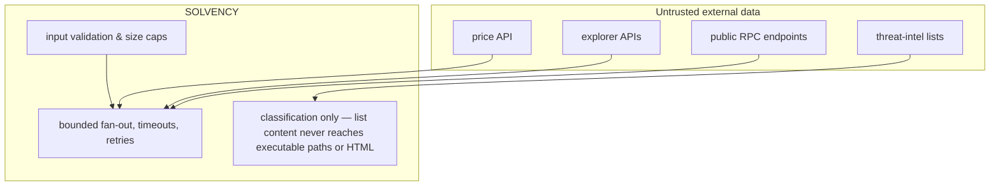

# SOLVENCY Architecture

## Agent → SOLVENCY paid call

## Valuation engine

## Trust boundaries

Key properties:
- payment verification is server-side only (OKX facilitator); the browser never decides a payment is valid
- unpaid requests never reach chain-data or valuation code (instrumented: `payment_gate_reached` vs `business_logic_reached` log events)
- RPC/explorer URLs are service-configured; caller-supplied URLs are never accepted
- missing external data degrades to `insufficient_data`, never to false-safe
- in-memory idempotency and rate limiting are single-instance; a multi-instance deployment must use a shared store (documented limitation)
